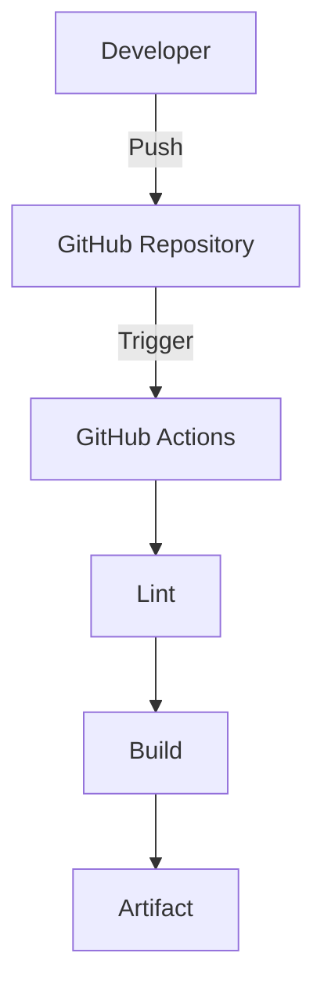

# nextjs-ci-portal
Automated CI/CD pipeline for a Next.js application using GitHub Actions, including code quality checks, build validation, and deployment automation.
# Next.js CI Portal

A DevOps-focused Next.js application demonstrating:

- GitHub Actions CI/CD
- Automated builds
- Source control with Git
- Modern web application deployment

# Next.js CI/CD DevOps Portal

## 📌 Overview
This project demonstrates a production-grade CI/CD pipeline using GitHub Actions and Vercel for automated deployment of a Next.js application.

## 🏗️ Architecture
Developer → GitHub → GitHub Actions → Build & Test → Vercel → Production

## ⚙️ Tech Stack
- Next.js
- GitHub Actions
- Node.js
- Vercel
- npm

## 🚀 CI/CD Workflow
- Code pushed to GitHub
- Automated CI pipeline triggered
- Linting + build validation executed
- Deployment to Vercel on successful build

## 🔐 Security
- Environment variables stored in GitHub Secrets
- No sensitive data in codebase

## 📊 Business Value
- Faster deployments
- Reduced manual errors
- Automated quality checks
- Scalable DevOps workflow

## 🔮 Future Improvements
- Unit testing (Jest)
- E2E testing (Playwright)
- Docker containerization
- Monitoring & logging

## Architecture Diagram

